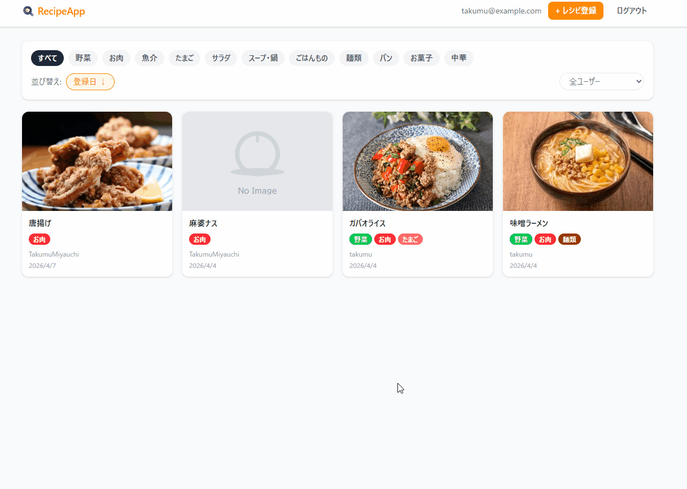

# 🍳 RecipeApp

## プロジェクト概要

**レシピ情報の備忘・共有アプリ**

一度おいしく作れたレシピも、次に作るときに「どのサイトを参考にしたか」を毎回探し直す手間が発生しがちです。
また、誰かと共有しようとするとメッセージアプリに送ることになり、他のチャットに埋もれてしまいます。

これらの課題を解決するため、レシピURLを手軽に登録・管理でき、複数ユーザー間で共有できるアプリを開発しました。

---

## 画面キャプチャ



---

## 技術スタック

### フロントエンド
| 技術 | バージョン |
|------|-----------|
| React | 19.2 |
| TypeScript | 5.9 |
| Tailwind CSS | 4.2 |
| Vite | 8.0 |
| React Router | 7.14 |
| Axios | 1.14 |

### バックエンド
| 技術 | バージョン |
|------|-----------|
| Java | 21 |
| Spring Boot | 3.5 |
| Spring Security | - |
| Spring Data JPA / Hibernate | - |
| jjwt | 0.12.7 |
| Lombok | - |

### データベース
| 技術 | 備考 |
|------|------|
| MySQL | ローカル環境: `recipeApp_Dev` |

### ビルドツール
- Gradle（Kotlin DSL）

---

## アーキテクチャ構成

```
┌──────────────────┐        REST API        ┌──────────────────┐        ┌──────────┐
│  フロントエンド    │ ─────────────────────> │  バックエンド      │ ──────> │  MySQL   │
│  React (SPA)     │ <─────────────────────  │  Spring Boot     │ <────── │          │
└──────────────────┘     JSON / JWT認証      └──────────────────┘        └──────────┘
```

- FEはSPA構成。認証はJWTトークンをlocalStorageで管理し、APIリクエスト時にAuthorizationヘッダへ付与
- BEはRESTful API。Spring SecurityによるJWT認証フィルターを実装
- パスワードはBCryptでハッシュ化してDBに保存

---

## ディレクトリ構成

```
recipe_app2/
├── FE/recipeApp/          # フロントエンド（React）
│   └── src/
│       ├── api/           # Axios APIクライアント
│       ├── components/    # 共通・機能別コンポーネント
│       ├── context/       # 認証コンテキスト
│       ├── pages/         # 画面コンポーネント
│       └── router/        # ルーティング設定
├── AP/260315/recipeApp/   # バックエンド（Spring Boot）
│   └── src/main/java/
│       ├── controller/    # APIエンドポイント
│       ├── service/       # ビジネスロジック
│       ├── repository/    # DBアクセス
│       ├── entity/        # DBエンティティ
│       ├── dto/           # リクエスト・レスポンス定義
│       └── security/      # JWT認証フィルター
└── docs/
    └── api.md             # API一覧
```

📄 [API一覧はこちら](./docs/api.md)

---

## 環境構築手順

### 前提条件
- Java 21
- Node.js 18以上
- MySQL 8.0以上

### 1. リポジトリのクローン
```bash
git clone https://github.com/TakumuMiyauchi/recipe_app2.git
cd recipe_app2
```

### 2. データベースのセットアップ
```sql
CREATE DATABASE recipeApp_Dev;
```

### 3. バックエンドの起動
```bash
cd AP/260315/recipeApp
```

環境変数を設定します（`.env` または `application-local.properties` に記載）:
```
DB_PASSWORD=your_mysql_password
JWT_SECRET=your_jwt_secret_key_32chars_or_more
```

```bash
./gradlew bootRun
```

### 4. フロントエンドの起動
```bash
cd FE/recipeApp
```

`.env` ファイルを作成します:
```
VITE_API_BASE_URL=http://localhost:8080
```

```bash
npm install
npm run dev
```

### 5. ブラウザでアクセス
```
http://localhost:5173
```

---

## こだわりポイント

- **JWT認証の自前実装**: Spring SecurityのフィルターチェーンにカスタムJWTフィルターを組み込み、トークンベースのステートレス認証を実現
- **現場のアーキテクチャを再現**: 現在参画しているプロジェクトのFE/BE分離構成を参考に設計
- **企画段階からの一貫した開発**: 要件定義・設計・実装まで一人で担当

---

## 今後追加したい機能

- [ ] AWS へのデプロイ（本番環境での稼働）
- [ ] URLだけでなくフリーテキストでのレシピ登録
- [ ] ログイン時のメール認証機能
